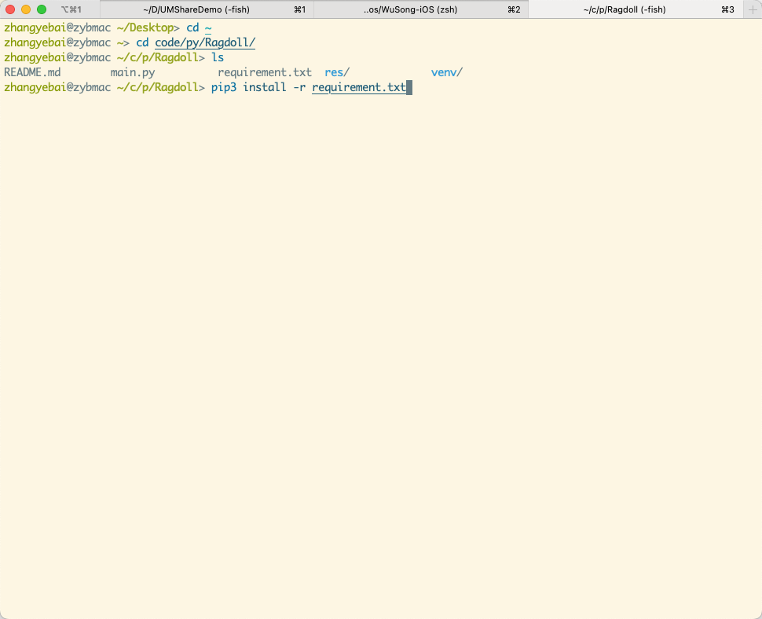
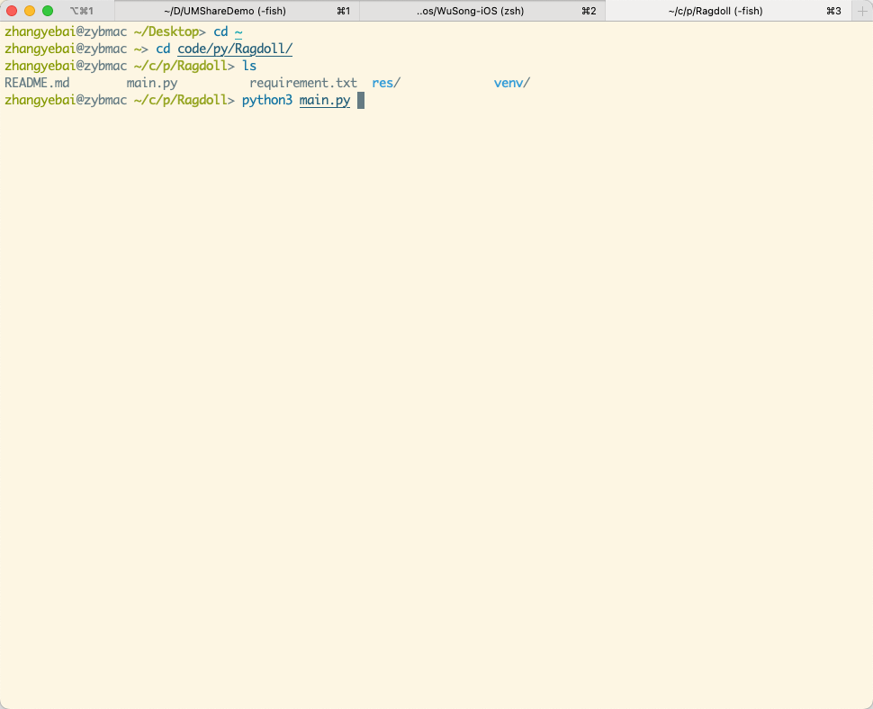
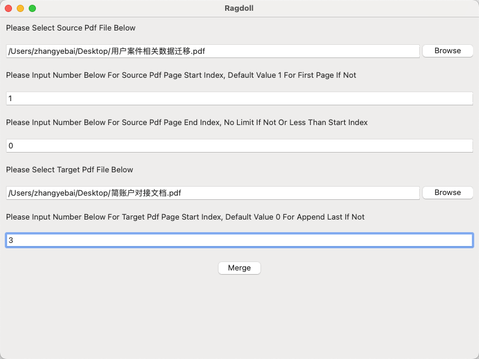

## Ragdoll Pdf Tool

### Install

    step 0: how to install Python 
[Install Python](https://www.python.org/)

    step 1: how to install Pip
[Install Pip For Python](https://pypi.org/project/pip/)

    step 2: how to install Dependencies

    
    step 3: how to run

    step 4: how to use
    将全部 '用户案件相关数据迁移.pdf' 插入到 '简账户对接文档.pdf' 第三页之后
    并基于上述内容重新生成一个新pdf: '简账户对接文档_20231204123000.pdf'

    step 5: how to review
    合并结束后会打开目标pdf所在的文件夹